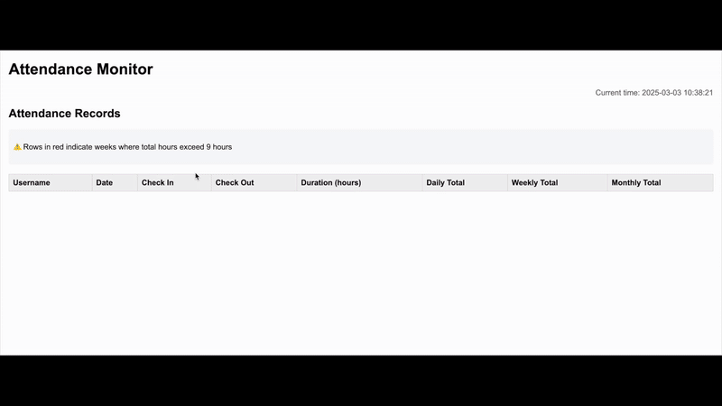

# 🤖 Attendance Bot System

A Telegram bot system for tracking employee attendance with a web monitoring interface.

## 📋 Features

- ✅ Check-in via Telegram command
- 🚪 Check-out tracking
- 📊 Web monitoring interface
- 📈 Daily, weekly, and monthly reports
- ⏰ Working hours tracking
- 📧 Email notifications for check-ins
- 🚨 Overtime alerts (>9 hours/week)




## 🛠️ Prerequisites

- Docker and Docker Compose
- Telegram account
- Gmail account (for notifications)

## 🔧 Setup

### 1. Create a Telegram Bot

1. Open Telegram and search for `@BotFather`
2. Send `/newbot` command
3. Follow the prompts to:
   - Set a name for your bot
   - Choose a username (must end in 'bot')
4. Save the API token provided by BotFather

### 2. Configure Environment

1. Clone this repository:
```bash
git clone https://github.com/gnzdotmx/Telegram-Attendance-Bot-System.git
cd Telegram-Attendance-Bot-System
```

2. Update `docker-compose.yml` with your credentials:
```yaml
environment:
  - TELEGRAM_BOT_TOKEN=your_bot_token_here
  - SMTP_USERNAME=your_gmail@gmail.com
  - SMTP_APP_PASSWORD=your_gmail_app_password
```

### 3. Gmail Setup for Notifications

1. Enable 2-Step Verification in your Google Account
2. Generate an App Password:
   - Go to Google Account Settings
   - Security → App Passwords
   - Select "Other" and name it "Attendance Bot"
   - Copy the generated password

### 4. 🚀 Launch the System

```bash
# Start all services
docker compose up -d

# View logs
docker compose logs -f

# Stop all services
docker compose down
```

## 💻 Usage

### Telegram Commands

- `/start` - Initialize the bot
- `/checkin` - Record attendance check-in
- `/checkout` - Record attendance check-out
- `/report` - View personal attendance history

### 🌐 Web Monitor

Access the monitoring dashboard at:
```
http://localhost:3366
```

Features:
- View all attendance records
- Track daily, weekly, and monthly hours
- Red highlighting for weeks exceeding 9 hours

## 🗃️ Database Management

### View Records
```bash
# Connect to database
docker compose exec postgres psql -U postgres -d attendance_db

# Common queries
-- View all records
SELECT * FROM attendance;

-- View today's attendance
SELECT * FROM attendance 
WHERE DATE(check_in) = CURRENT_DATE;

-- View active check-ins
SELECT * FROM attendance 
WHERE check_out IS NULL;
```

### Test Data
```sql
-- Insert test check-in/out
INSERT INTO attendance (employee_id, masked_uid, username, check_in, check_out) 
VALUES 
('12345', 'A1B2C3D4', 'testuser', '2025-02-24 09:00:00', '2025-02-24 19:00:00');
```

## 📁 Project Structure

```